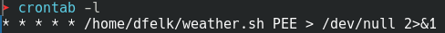

### Фельк Дмитрий Александрович ФИТ-2-2024 НМ

# Практическая работа 2. Автоматизация в Linux

#### <u>Задание: Написать bash-скрипт, который принимает в качестве входящего параметра город. Выводит температуру и влажность в текущий день в этом городе. Установить nginx. Скрипт запускать по крону раз в минуту, вывод сохранять в index.html дефолтного сайта.</u>

## Полготовка веб-сервера

Устанавливаем nginx:

Запускаем службу:

Проверяем через браузер, что сервер заработал:

Устанавливаем утилиту для парсинга json:

Извлекаем температуру и влажность из результатов запроса погоды:

Проверяем права на индексный файл:

Разрешаем запись в файл:

Создаем файл скрипта и заполняем его:

Даем права на выполнение скрипта:

Запускаем скрипт и проверяем перезапись индексного файла:

Устанавливаем планировщик:

Редактируем задания планировщика:

Запускаем службу:

Проверяем работу планировщика в браузере:

